# Optimizing Production & Supply Chain with Customer Segmentation (Case Study: SmartHome Solutions)

This project empowers SmartHome Solutions Inc. to optimize production planning and supply chain efficiency by leveraging customer data for segmentation and profiling. Utilizing Microsoft Excel, it drives data-driven decisions to reduce inefficiencies, align production with demand, and minimize excess inventory.

# Business Context
SmartHome Solutions Inc., a global leader in consumer electronics and home appliances, faces challenges with traditional supply chain planning methods that rely heavily on historical data. This has resulted in:
- Overproduction and underproduction cycles
- Disconnect between production and actual customer demand
- Excess inventory is tying up valuable resources
This project introduces a customer-centric, data-driven approach to resolve these challenges.

# Project Rationale
With the logistics and supply chain sector shifting towards data-driven operations, this project is essential for:
- **Operational Efficiency:** Streamlining processes, lowering costs, and optimizing resources.
- **Customer Satisfaction:** Meeting preferences and ensuring timely product availability.
- **Competitive Advantage:** Enabling faster responses to market shifts and customer needs.
- **Cost Reduction:** Preventing overproduction and cutting inventory-related expenses.
- **Sustainability:** Reducing waste and supporting corporate responsibility goals.

# Objectives of the Project
- **Customer Segmentation:** To segment and profile SmartHome Solutions Inc.'s customer base to gain insights into their preferences, buying behaviors, and geographic distribution.
- **Data-Driven Planning:** To enhance production planning, inventory management, and distribution strategies based on customer segments, thereby reducing overproduction and minimizing excess inventory.

# Data Overview
- **Customer Data:** Customer_ID, Age, Gender, Income, Location.
- **Sales Data:** Transaction_ID, Customer_ID, SKU, Quantity, Timestamp.
- **Inventory Data:** SKU, Current Inventory Level, Stockouts (days),	Replenishment Lead Time (days), Storage Location,	Shelf Life (days).
- **Production Data:** SKU,	Production Schedule_ID,	Lead Time (days),	Production Capacities (units per hour),	Resource Allocation.

# Tech Stack
Microsoft Excel for:
- Data processing and cleaning
- Customer segmentation and profiling
- Pivot tables, charts, and dashboards for insights and reporting

  # Data Cleaning & Pre-processing
  **Missing values:** No missing values were present in the dataset

  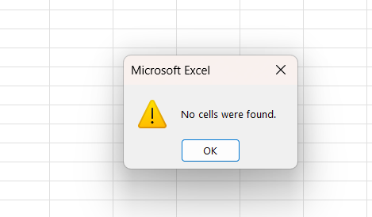

  
  **Duplicates:** No duplicates were found in the dataset

  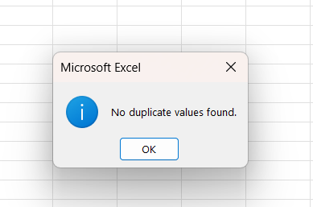

  
- The date and the time were extracted into different columns from the timestamp and placed in the right format.

# Exploratory Data Analysis
**Age Distribution:**

  A histogram chart was used to examine the age distribution of the customers. The maximum, minimum, average, and median ages were found and used to analyse the distribution.

  Max Age	69
  
  Min Age	18
  
  Avg Age	43
  
  Median Age	43

This indicates that the population is distributed fairly evenly across the age ranges, although there are some noticeable variations. Age brackets 24–30, 48–54, and 60–66 have the highest counts. This suggests a stronger concentration as shown below;

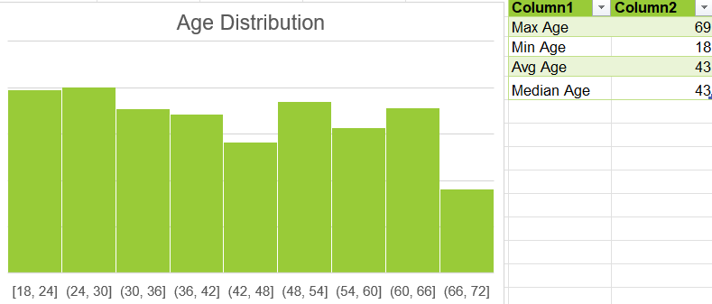

**Income Distribution:**

A histogram chart was also used to visualize the income distribution of the customers. The minimum, maximum, average, and median incomes were found.

Max Income	$149,973

Min Income	$20,146

Avg Income	$83,269

Median Income	$81,772.

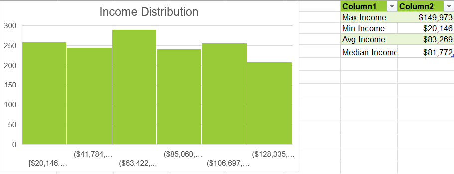

The image above shows that the income is divided into 6 ranges, showing a fairly balanced distribution, with one standing out. The $63,422–$85,060 income bracket has the most customers, while fewer customers earn in the lowest ($20,146–$41,784) and highest ($128,335+) ranges. This indicates that most customers belong to the middle-income earners.

**Geographic Distribution:**

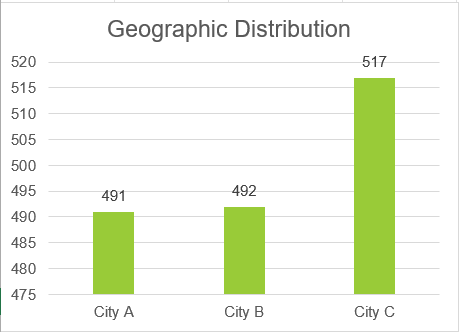

City C has the largest customer base (approx. 517 customers), ahead of Cities A and B.
This suggests City C may have the highest market potential, but it  has the least total sales by region. So it's not a guarantee that products will sell in regions with high customer demand. Together, City A and City B form a mid-sized customer pool. Examining the best-selling SKU  by customer segments in different regions, in cities A, B, and C, the Platinum A group has the highest customer patronage by purchasing products SKU 36, 95, and 41, respectively. Even though these products are not the best sellers in their cities A and C, except for City B, whose best-selling product is SKU 95. This shows that the Platinum A in City B drives the sales in the city.

# Customer Segmentation Framework
**1. Age Groups**
- Adults: 18 – 40 years
- Midlifers: 41 – 60 years
- Seniors: 61 – 69 years

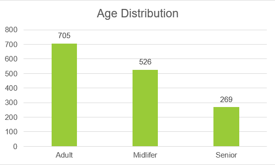

**2. Income Groups**

Income segmentation is based on Median Income (81,771.50).
- Low Income:  Are those who earn less than 80% of the Median income. That is less than 0.8 * 81,771.50.
- High Income: Are those who earn more than the Median income. That is greater than 81,771.50.
- Middle Income: Are those who earn between the Low and High income thresholds. That is between 65,417.20 and 81,771.50.

  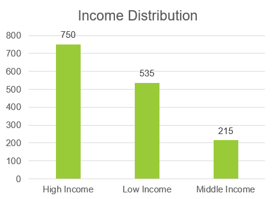

  # Customer Segment Exploration & Profiling
Here, the customers are profiled based on their age and income. Adults, midlifers, and Senior age groups are categorised into high, middle, or low income earners. 
There are nine (9) categories in total. They are;
- 🔘 High Income/Adults --  Platinum A
- 🔘 High Income/Midlifers -- Platinum M
- 🔘 High Income/Seniors -- Platinum S

- 🥇 Middle Income/Adults --  Golden A
- 🥇 Middle Income/Midlifers -- Golden M
- 🥇 Middle Income/Seniors -- Golden S

  
- ⚪ Low Income/Adults --  Silver A
- ⚪ Low Income/Midlifers -- Silver M
- ⚪ Low Income/Seniors -- Silver S
  
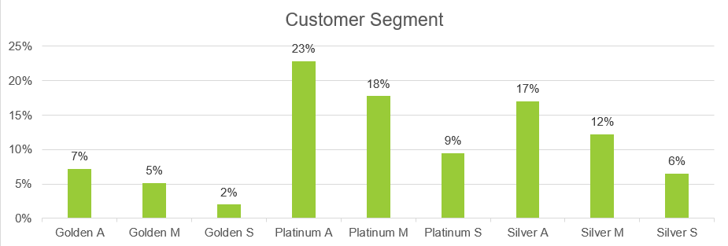

The Platinum A (23%) has the largest share of the customer group. These are high-income earning adults (18–40 yrs), forming nearly a quarter of the customer base.
Platinum M(18%) and Silver A (17%) also make up significant portions, showing strong representation in both middle-aged high-income and adult low-income brackets.

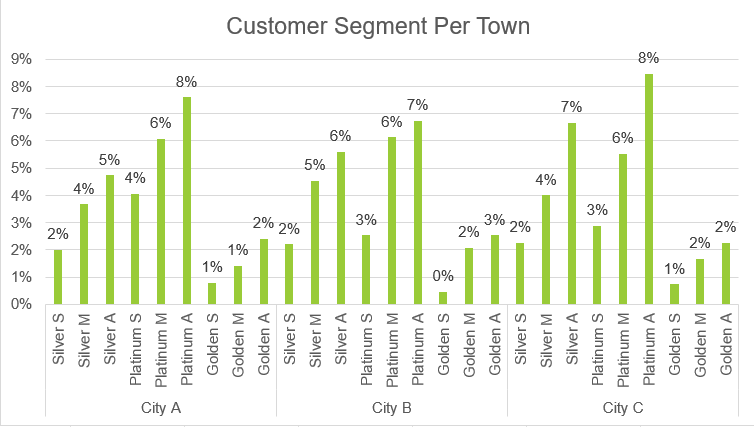

- City A
Platinum A (8%) → Dominant group, largest share in the city.
This implies that it is driven by high-income adults and midlifers, with a notable presence of low-income adults.
- City B
Platinum A (7%) and Platinum M (6%) are the top groups.
City B has a balanced mix of Platinum and Silver customers, suggesting opportunities across both income ranges.
- City C
Platinum A (8%) again leads, making them the strongest group across all cities.
City C has the largest concentration of Platinum and Silver customers, indicating the highest potential for diversified targeting.

# Data Modelling
Power Query was used to model the dataset and establish relationships between the tables. The resulting Relational Diagram is shown below.

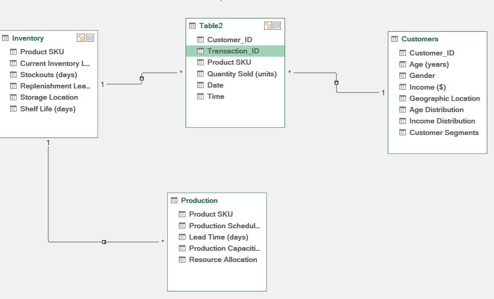

# Understanding Customer Preference
We examine the product table to understand the customers' preferences based on the best-selling product SKU in each city and by each customer segment.

**Monthly Sales Trend**

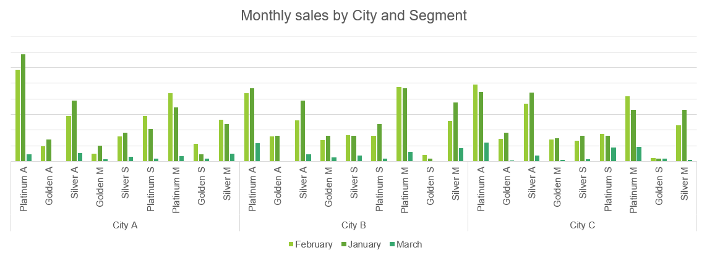

Platinum  A dominates sales in all three cities, A, B, & C.  Especially in City A, where they are the largest contributor overall. Across all cities, January consistently shows the highest sales volumes, with a slight drop in February and further decline in March. This suggests seasonality or a post-holiday demand spike in January.

Examining the best-selling SKU by customer segment, Product SKUs 36, 83, and 41 have the highest sales among the Platinum A segment, which has the highest total product sold.
Looking at the best-selling SKU in different regions, City C, which has the highest number of customers, has the least total sales by region. So it's not a guarantee that products will sell in regions with high customer demand.

# Analytical Questions
1. How popular are the customers in each city?
2. Who buys the most among the customer segments?
3. How much do we sell to each customer segment monthly?
4. What is the best-selling product SKU based on quantity sold?
5. What are the current inventory levels of each product SKU?
6. What products are out of stock? How long would it take to replenish them?
7. What is the current production capacity in hours?

**1. How popular are the customers in each city?**

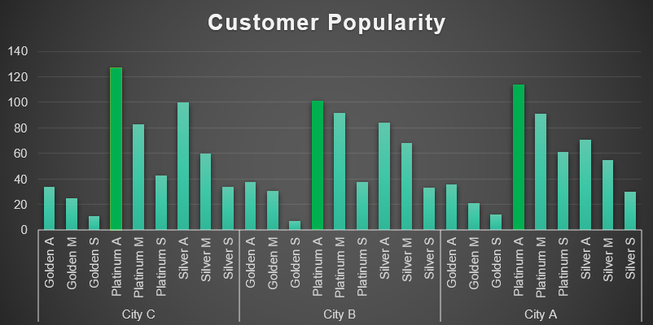

Platinum A is the most popular segment and  dominates in all three cities.
Platinum Ms and Silver A are strong secondary groups across all locations.
Golden S are consistently minor everywhere.
City C is the strongest for high-income adults, while City A shows relatively more strength in senior segments.

**2. Who buys the most among the customer segments?**

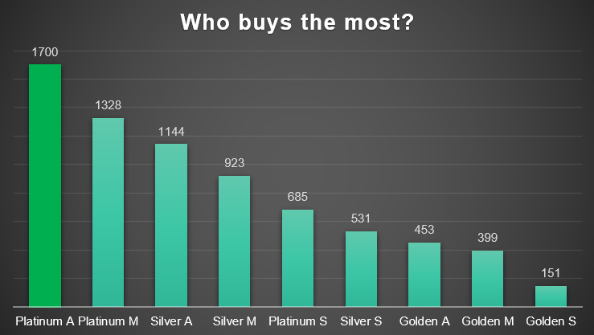

Platinum A (1700 purchases) is the top buyer by a wide margin, making them the single most important customer group.
It represents young to middle-aged high-income earners, driving core business revenue.

**3. How much do we sell to each customer segment monthly?**

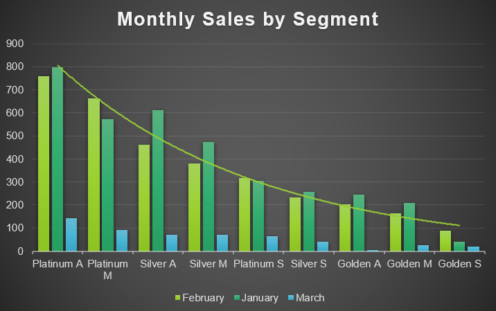

January is the highest sales month across all segments.
This may be as a result of the seasonality effect, i.e, possibly post-holiday demand.

February remains strong but slightly below January. March drops sharply across all groups, showing a seasonal decline.

Platinum A has consistently been the highest sales segment across all months.
Peaked in January by approx. 800 sales, with strong volumes in February and smaller but notable sales in March.

**4. What is the best-selling product SKU based on quantity sold?**

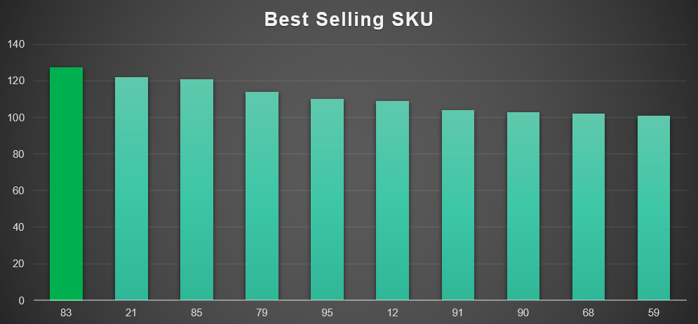

SKU 83 (127 units) is the best-selling product overall, while SKUs 21 & 85 (120 units each) are close as they both perform nearly as well as SKU 83.

The top 3 SKUs (83, 21, 85) altogether account for the largest share of total sales. These are the key drivers of product demand.

**5. What are the current inventory levels of each product SKU?**

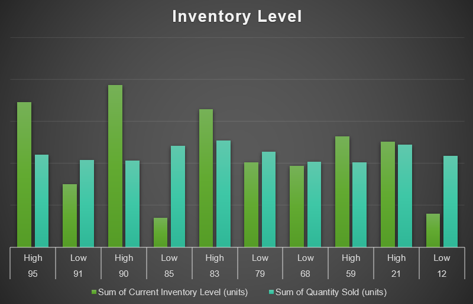

- SKU 95 & SKU 90 (High Inventory, Moderate Sales): Their current inventory levels are much higher than sales volume.
There is a risk of overstocking, potential storage costs, or unsold goods.
- SKU 85 & SKU 12 (Low Inventory, High Sales): The sales volumes are higher than the current stock.
There is a clear risk of stockouts.
- SKU 59 (High Inventory, Lower Sales): The inventory level is higher than sales.

**6. What products are out of stock? How long would it take to replenish them?**

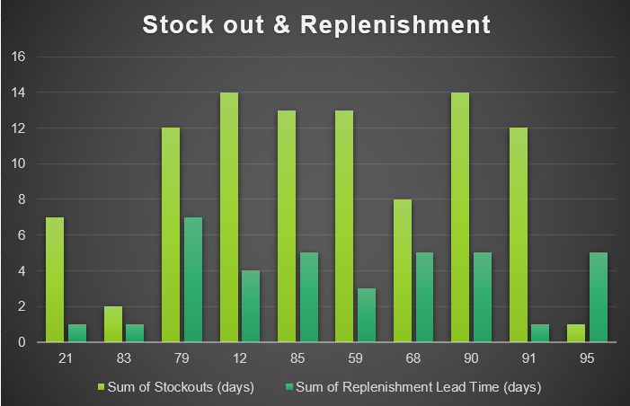

- SKUs 12, 85, 59, 90, 79, 68, 91 have very high stockout days (12–14 days) compared to replenishment lead times this indicates frequent demand exceeding supply.

**7. What is the current production capacity in hours?**

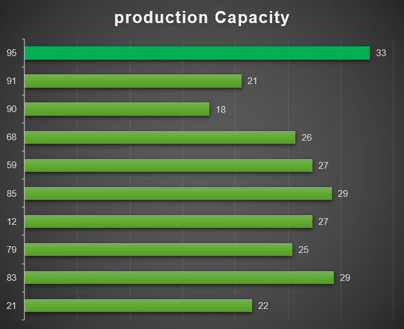

SKU 95 has the strongest capacity, but earlier inventory/sales analysis showed it risks overstocking → production here may need scaling down.
SKU 95 (33 units) has the highest production capacity.
SKU 85 & SKU 83 (29 units each) have strong capacity, aligned with high-demand products.

# Key Insights

- **Diverse Customer Base:** There is a balanced distribution across age groups, gender, and income levels. The customer base is broad and requires segmented strategies.
- **Segment Drivers:**
Platinum A group (high-income, 18–40) is the largest and most profitable group.
Platinum M and Silver A are strong secondary contributors.
Golden segments have minimal impact.
- **Regional Variations:**
City C leads in customer volume.
City B shows a balanced mix of both Platinum and Silver.
City A has a strong Platinum base, but also more senior demand.
- **Product Performance:**
The top 3 SKUs (83, 21, 85) drive the majority of sales and require priority stocking.
Some SKUs (95, 90, 59) risk overstocking, while others (85, 12) face stockouts.
- **Sales Trends:**
January is the peak sales month. Seasonality must be built into production planning.
There is a decline in Feb–March, highlighting the need for dynamic inventory scaling.
- **Inventory & Supply Chain Gaps:**
There is a misalignment between production capacity and demand.
Overcapacity in some SKUs (95) and bottlenecks in others (90, 91, 21).
Long stockouts (12–14 days) of high-selling SKUs despite replenishment highlight forecasting issues.

# Recommendations
**1. Product Strategy**
Diversify Offerings by tailoring products to the needs of Platinum, Silver, and niche Golden groups.
Focus and prioritize top SKUs (83, 21, 85) for production and stocking.
Apply lean production to Golden/low-demand items to minimize waste.

**2. Inventory Management**
Apply dynamic Stocking by adjusting inventory in real-time based on segment demand and seasonality.
Restock SKUs 85 & 12 urgently, and reduce excess in 95, 90, 59.
Establish buffer stock for high-demand SKUs prone to stockouts.

**3. Marketing & Sales**
Design targeted campaigns (e.g., premium for Platinum A, value-driven for Silver A).
Seasonal Promotions: Concentrate campaigns in January and pre-holiday periods to maximize sales.
Build customer loyalty through community-driven engagement and responsive service.

**4. Production Planning**
Expand capacity for high-demand SKUs (83, 85, 12).
 Reduce production for SKU 95 and other slow movers.
Increase production flexibility for low-capacity SKUs (90, 91, 21).

**5. Regional Strategies**

City C: Push premium offerings (Platinum focus).

City B: Balanced portfolio of Platinum + Silver products.

City A: Diversify to include senior-friendly products.

Align stock levels with city-specific demand.

# Conclusion
In conclusion, SmartHome Solutions can optimize its supply chain by focusing on Platinum A, balancing SKU inventory, tailoring strategies by city, and aligning production capacity with real demand. A phased implementation ensures immediate fixes for stockouts/overstocks while building a long-term, data-driven, customer-centric supply chain.

# Dashboard

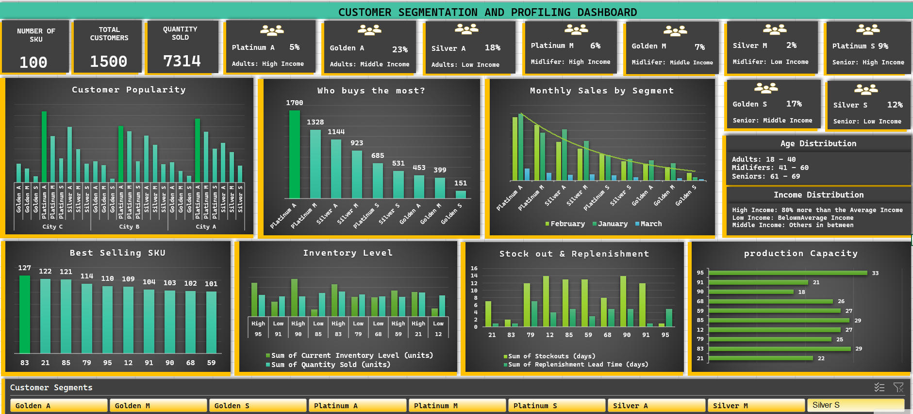
